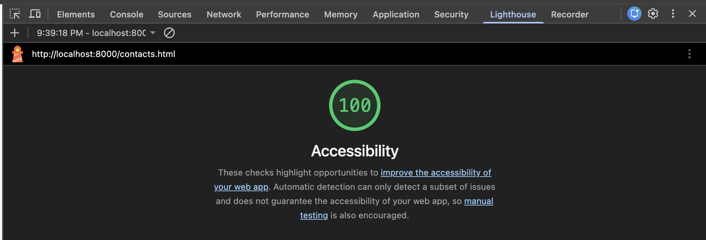
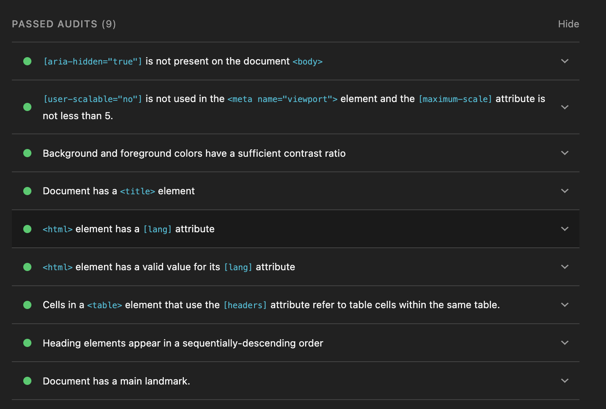
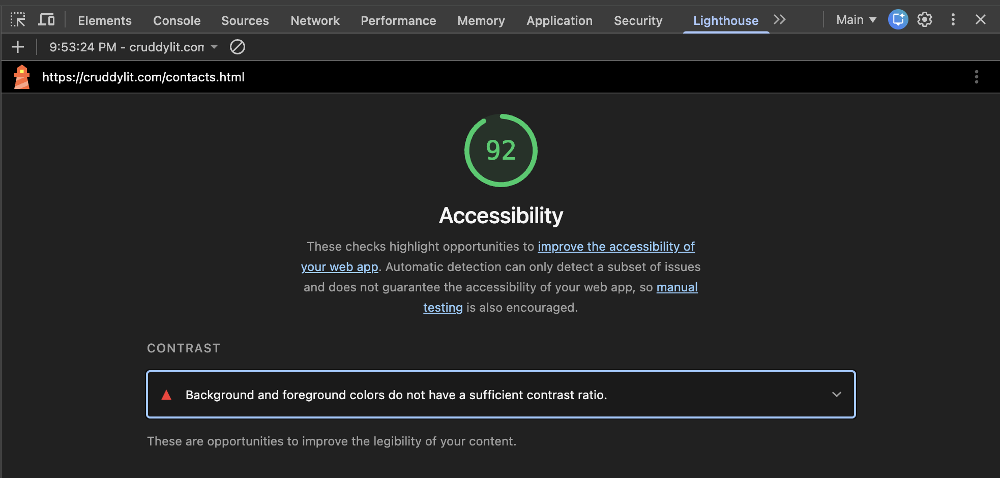
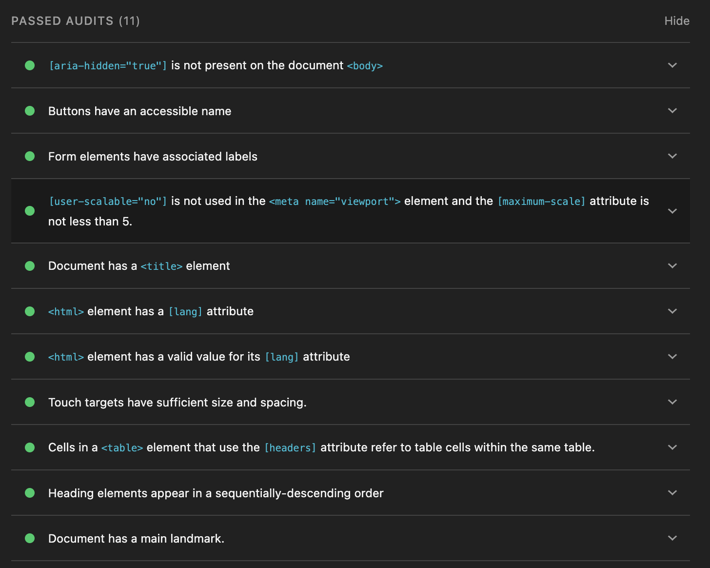

# Lighthouse Accessibility Report — Contacts Page

## Methodology

- **Tool:** Chrome DevTools Lighthouse, Accessibility category only
- **"Before" snapshot:** static hardcoded version of `contacts.html` (commit `dc3eb34`, "Add bootstrap styling to the contacts page"), checked out via a git worktree and served locally with `python3 -m http.server`
- **"After" snapshot:** live production page at `cruddylit.com/contacts.html`, accessed while logged in

## Before — Score 100/100

9 passed audits, 0 failed. At this stage the page was a static table with no
forms, buttons, or interactive elements, so entire categories of accessibility
checks — label association, button naming, touch target sizing — weren't yet
applicable to the page at all.

## After — Score 92/100

11 passed audits, 1 failed:

- **Failed:** Background and foreground colors do not have a sufficient contrast ratio
- **Newly passing (not applicable in the "before" version):** Form elements have
  associated labels, Buttons have an accessible name, Touch targets have
  sufficient size and spacing

## Trajectory

The score drop from 100 to 92 reflects added functionality. The original static page had almost no interactive surface area for Lighthouse to test against. As real CRUD functionality was built out, a code review caught a missing `<label>` on the search input, the most common Lighthouse accessibility failure, and it was fixed before merge. That same process of adding real interactivity surfaced one remaining issue, a color contrast problem, which is scheduled to be addressed during the
upcoming UI pass.

## Next Steps

- Fix the flagged contrast issue during planned UI updates
- Re-run Lighthouse after UI changes and update this report with the final score
