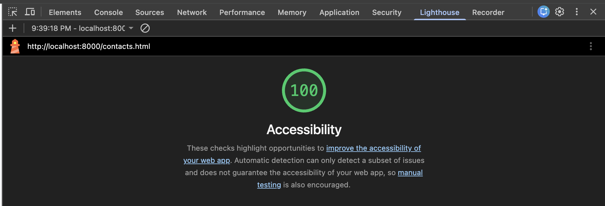
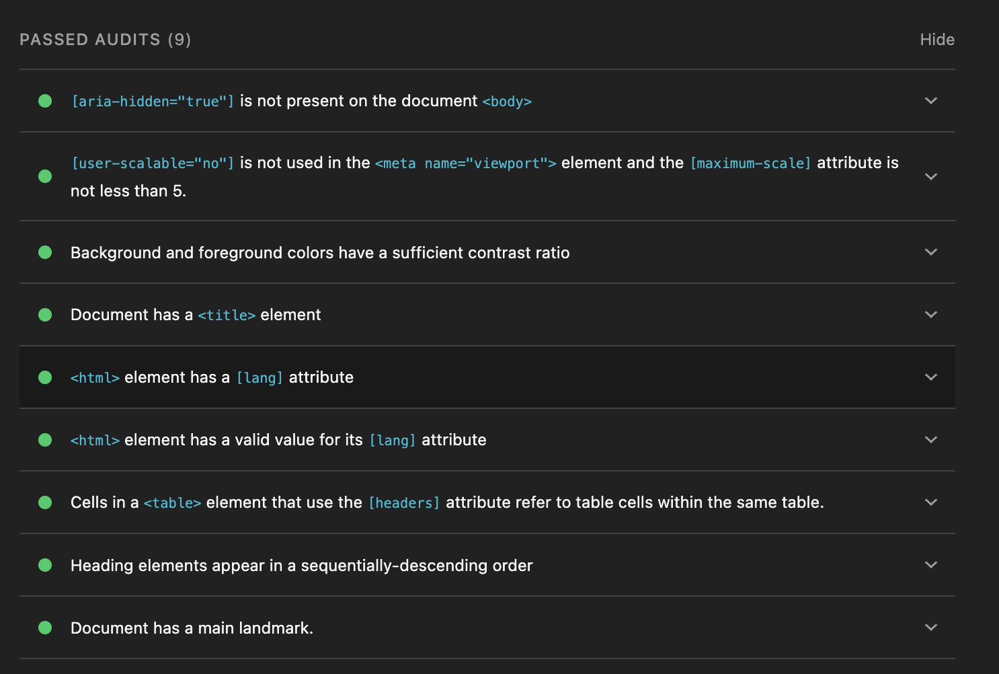
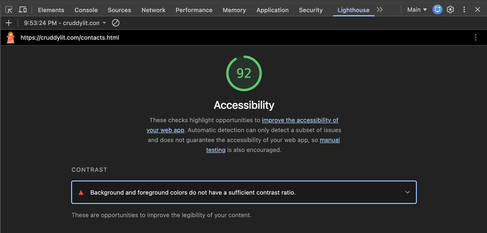
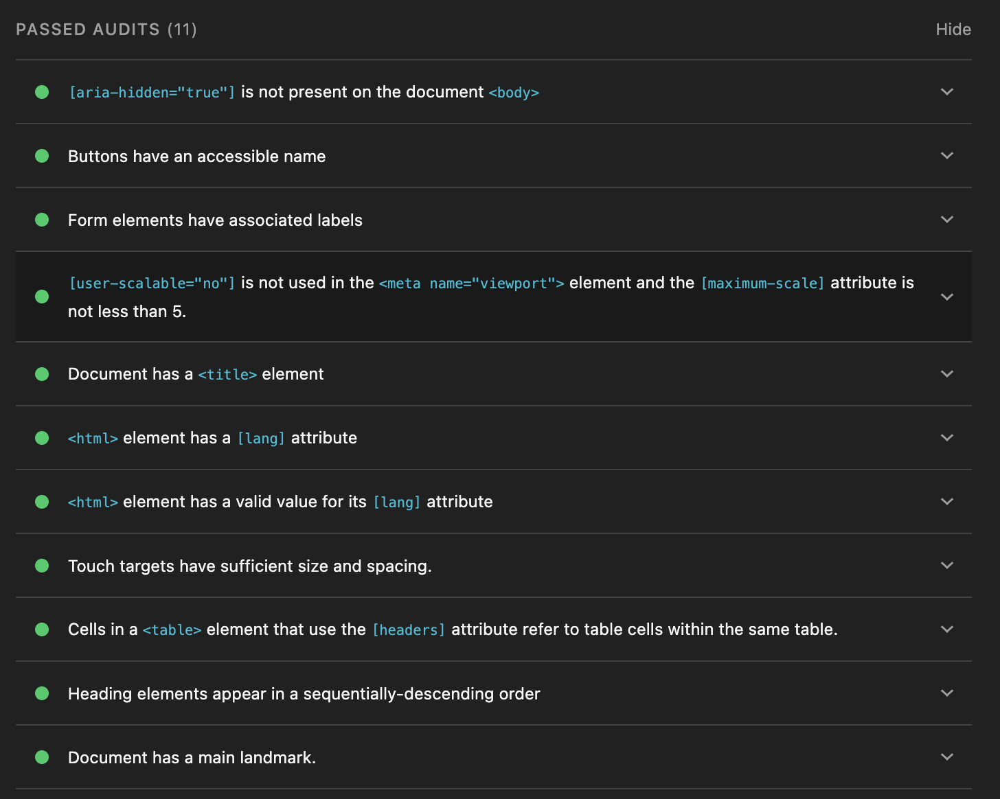
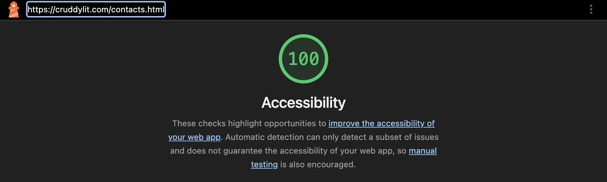
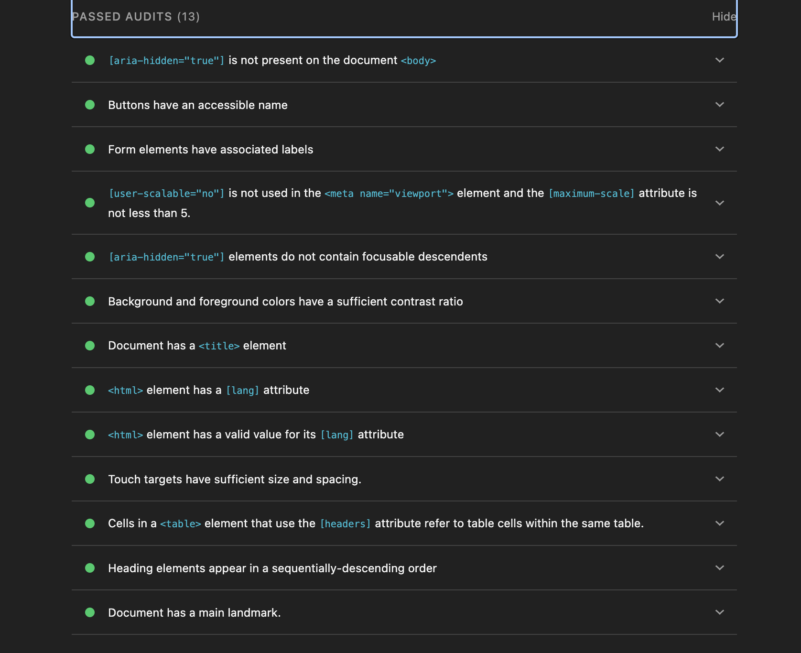
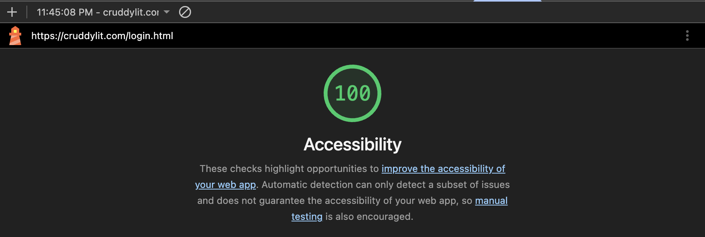
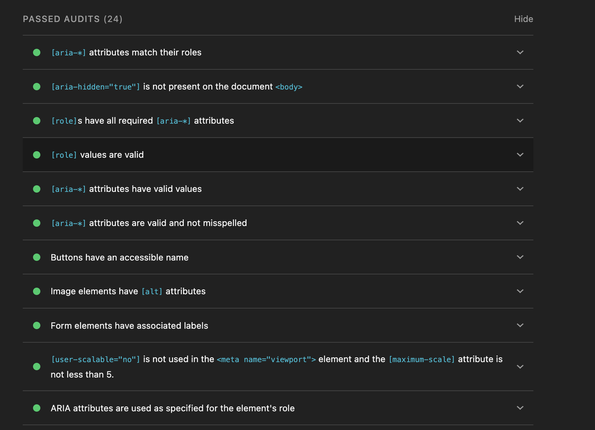

# Lighthouse Accessibility Report

This report tracks Lighthouse accessibility scores for the Contacts page across
three snapshots, and adds a baseline for the Login page following the UI redesign.

## Methodology

- **Tool:** Chrome DevTools Lighthouse, Accessibility category only
- **Contacts "Before" snapshot:** static hardcoded version of `contacts.html` (commit `dc3eb34`, "Add bootstrap styling to the contacts page"), checked out via a git worktree and served locally with `python3 -m http.server`
- **Contacts "After" snapshot:** live production page at `cruddylit.com/contacts.html`, accessed while logged in, before the UI redesign
- **Contacts "After UI Pass" snapshot:** live production page at `cruddylit.com/contacts.html`, accessed while logged in, after the black and gold UI redesign
- **Login snapshot:** live production page at `cruddylit.com/login.html`, after the black and gold UI redesign

## Contacts Page

### Before — Score 100/100

9 passed audits, 0 failed. At this stage the page was a static table with no
forms, buttons, or interactive elements, so entire categories of accessibility
checks — label association, button naming, touch target sizing — weren't yet
applicable to the page at all.

### After — Score 92/100

11 passed audits, 1 failed:

- **Failed:** Background and foreground colors do not have a sufficient contrast ratio
- **Newly passing (not applicable in the "before" version):** Form elements have
  associated labels, Buttons have an accessible name, Touch targets have
  sufficient size and spacing

### After UI Pass — Score 100/100

13 passed audits, 0 failed:

- **Fixed:** Background and foreground colors have a sufficient contrast ratio
- **Newly passing:** `[aria-hidden="true"]` elements do not contain focusable
  descendants. The redesign added decorative brand marks hidden from screen
  readers, and none of them contain focusable content.

## Login Page — Score 100/100

24 passed audits, 0 failed. The Login page has more ARIA usage, images, and form
controls than the Contacts page, so Lighthouse runs a larger set of checks
against it, including `[aria-*]` attribute and role validity, image `alt`
attributes, and form label association. All of them pass.

## Trajectory

The Contacts page score dropped from 100 to 92 as real functionality was added.
The original static page had almost no interactive surface area for Lighthouse
to test against. As CRUD functionality was built out, a code review caught a
missing `<label>` on the search input, the most common Lighthouse accessibility
failure, and it was fixed before merge. The one remaining issue, a color
contrast problem, was addressed during the black and gold UI redesign, bringing
the Contacts page back to 100 with more audits applicable than the original
static version. The Login page, audited for the first time after the redesign,
also scores 100.

